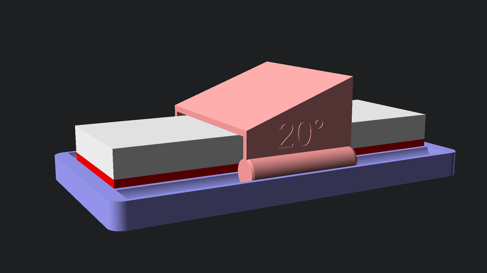

# Whetstone guide

A parametric whetstone guide for sharpening knifes. Configurable up to four
different sharpening angles.



## Customization

The main parameters to adjust are:

| Parameter name | Description |
| -------------- | ----------- |
| `stone_width` | Width (in mm) of the whetstone |
| `stone_height` | Height (in mm) of the whetstone |
| `stone_length` | Length (in mm) of the whetstone |
| `guide_length` | Length (in mm) of the guide |
| `guide_angle_1` | Angle (in °) of the first guide |
| `guide_angle_2_enabled` | Whether to create a second guide |
| `guide_angle_2` | Angle (in °) of the second guide |
| `guide_angle_3_enabled` | Whether to create a third guide |
| `guide_angle_3` | Angle (in °) of the third guide |
| `guide_angle_4_enabled` | Whether to create a fourth guide |
| `guide_angle_4` | Angle (in °) of the fourth guide |

## How-to

The OpenSCAD source code is placed in the `scad/` folder. Either open the `*.scad` files interactively
in the OpenSCAD GUI or run the following command to build the `*.stl` and `*.png` files:

```
make
```

Output files will be placed in the `stl/` and `preview/` folder.

Note: In preview mode, the whole assembly is rendered as the final assembly,
while in render mode, the parts are laid out for printing.

## License

<p xmlns:cc="http://creativecommons.org/ns#" xmlns:dct="http://purl.org/dc/terms/"><a property="dct:title" rel="cc:attributionURL" href="https://github.com/anorm/whetstone-guide">Whetstone guide</a> © 2026 by <span property="cc:attributionName">anorm</span> is licensed under <a href="https://creativecommons.org/licenses/by-sa/4.0/?ref=chooser-v1" target="_blank" rel="license noopener noreferrer" style="display:inline-block;">CC BY-SA 4.0</a></p>


